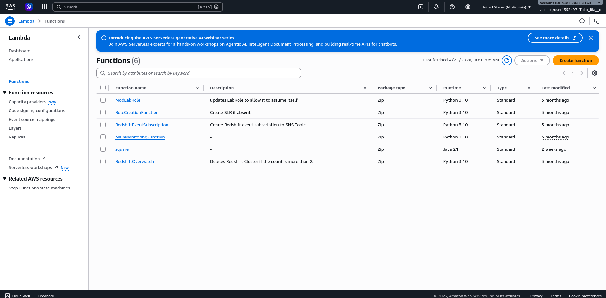
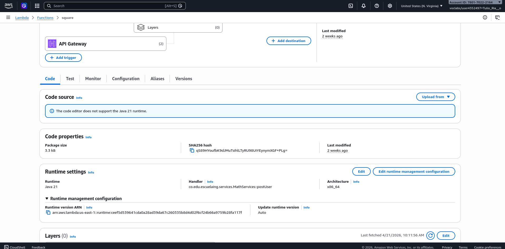
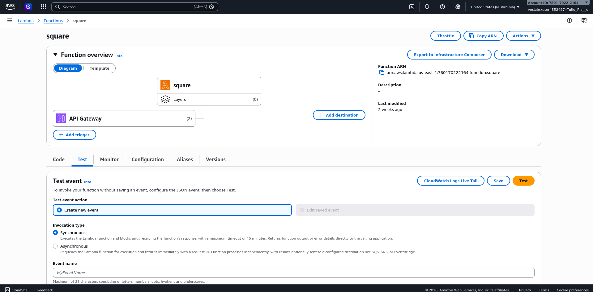
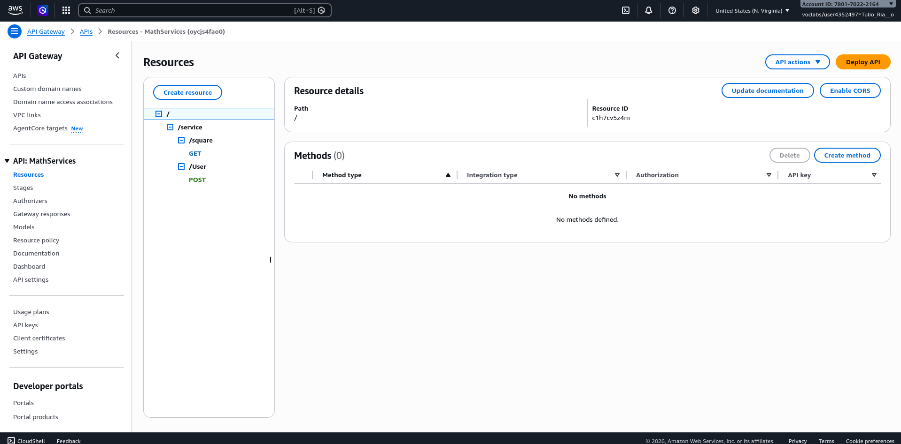

# MathLambdaWorkshop

Introduction to microservices with Java on AWS Lambda and AWS API Gateway. This tutorial implements a REST service that calculates the square of an integer, covering the steps of writing the function, uploading it to Lambda, and exposing it through API Gateway.

## Getting Started

These instructions will help you get a copy of the project, compile it, deploy it to AWS Lambda, and expose it through API Gateway.

### Prerequisites

- Java 8 or higher
- Maven
- AWS account (Academy or other) with access to Lambda and API Gateway
- An IAM role with permissions to execute Lambda functions (e.g., `LabRole` for AWS Academy users)

### Installing

1. Clone the repository:

```bash
git clone https://github.com/TulioRianoSanchez/MathLambdaWorkshop.git
cd MathLambdaWorkshop
```

2. Compile and package the project with Maven:

```bash
mvn package
```

This will generate `target/MathLambdaWorkShop-0.0.1-SNAPSHOT.jar`, which is the file you will upload to AWS Lambda.

## Deployment

### 1. Create the service class

The project implements the `MathServices` class with static methods that receive parameters and return results. The main method for this tutorial calculates the square of an integer:

```java
package co.edu.escuelaing.services;

public class MathServices {

    public static Integer getSquare(Integer i) {
        return i * i;
    }

    public static String getUser(User u) {
        return u.getName() + " - " + u.getEmail();
    }

    public static User postUser(User u) {
        return u;
    }
}
```

The `User` class is a POJO that AWS Lambda automatically serializes/deserializes to and from JSON:

```java
package co.edu.escuelaing.services;

public class User {
    private String name;
    private String email;
    // constructors, getters, and setters
}
```

### 2. Create the Lambda function

1. In the AWS console, navigate to the **Lambda** service.
2. Click **Create function** > **Author from scratch**.
3. Give the function a name, for example `square`.
4. Set the **Runtime** to Java 8 (or Java 21, depending on availability).
5. Under **Permissions**, select an existing role (use `LabRole` if you are an AWS Academy user).

Once the function is created, upload the compiled JAR:

1. In the **Code source** section, click **Upload from** > **.zip or .jar file** and upload the generated JAR.
2. In **Runtime settings**, edit the **Handler** field to:

```
co.edu.escuelaing.services.MathServices::getSquare
```

3. Save the changes.

### 3. Configure the API Gateway

1. Open the **API Gateway** service in the AWS console.
2. Create a new **REST API** > **New API**.
3. Name it `mathServices` and select **Regional** as the endpoint type.
4. Under **Resources**, create a resource `/service/square` and add a **GET** method.
5. Configure the GET method to invoke the `square` Lambda function.
6. In **Method Request**, add the `value` parameter under **URL Query String Parameters**.
7. In **Integration Request**, add a **Mapping Template** with `Content-Type: application/json` and the following body:

```
$input.params("value")
```

8. Deploy the API: go to **Actions** > **Deploy API**, create a new stage (e.g., `Beta`).

The resulting URL will follow this pattern:

```
https://<id>.execute-api.us-east-1.amazonaws.com/Beta/service/square?value=5
```

Expected response:

```
25
```

> **Important:** Remember to delete the Lambda function and the API Gateway when you are done to avoid unnecessary charges.

## Running the Tests

### Direct test in the Lambda console

From the AWS Lambda console, open the **Test** tab of the `square` function:



Configure a test event with only the integer value (no JSON), for example `5`, and run the test:



Verify the test event configuration before running it:



### Test through the API Gateway

Once the API is deployed, verify the configured resources in API Gateway (`/service/square` with GET and `/User` with POST):



From the **Test** section of the GET method in API Gateway, enter the `value` parameter with an integer. You can also test the public URL directly:

```
https://<id>.execute-api.us-east-1.amazonaws.com/Beta/service/square?value=14
```

Expected result: `196`

## Built With

- [Java](https://www.java.com/) - Programming language
- [Maven](https://maven.apache.org/) - Dependency management and packaging
- [AWS Lambda](https://aws.amazon.com/lambda/) - Serverless function execution platform
- [AWS API Gateway](https://aws.amazon.com/api-gateway/) - REST service exposure

## Authors

- **Tulio Riaño Sánchez** - *Initial work*

## License

This project is licensed under the MIT License - see the [LICENSE](LICENSE) file for details.

## Acknowledgments

- AWS documentation on [API Gateway Mapping Templates](https://docs.aws.amazon.com/apigateway/latest/developerguide/api-gateway-mapping-template-reference.html)
- [aws-lambda-java-events](https://github.com/aws/aws-lambda-java-libs/tree/main/aws-lambda-java-events) - Predefined event types library for AWS Lambda with Java
